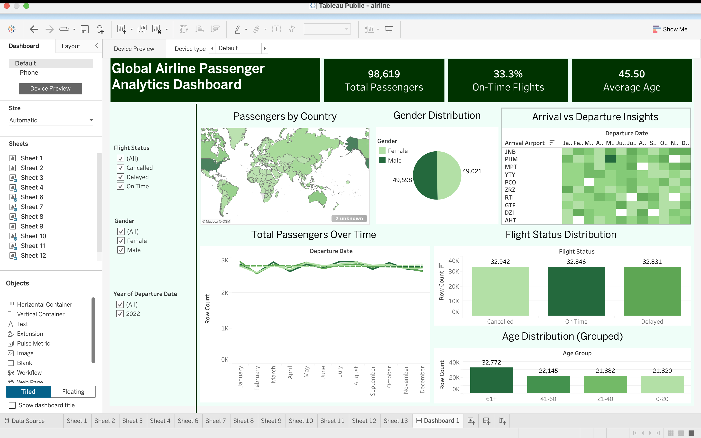

# Airline Performance Analytics Dashboard

## Project Overview
This project analyzes airline performance data to uncover flight trends, airport activity, and operational patterns using Tableau. The dashboard is designed to present key metrics and performance insights through interactive visualizations.

## Tools Used

- Tableau Desktop
- Data Visualization
- Dashboard Design
- Data Cleaning
- KPI Reporting
 
## Dataset
The dataset contains airline operational data such as flight activity, arrivals, departures, airport performance, and related operational indicators used for analysis and dashboard creation.

## Dashboard Features
- Arrival and departure analysis
- Airport-wise performance
- Interactive filters
- KPI indicators

## Key Insights

- Identified trends in airline arrivals and departures
- Compared airport-wise performance and activity levels
- Highlighted operational patterns using KPI indicators
- Created an interactive view to support easier performance tracking

## Dashboard Preview

## Files Included

- Airline Dataset.csv → Source dataset
- airline.twbx → Tableau dashboard file
- dashboard_preview.png → Dashboard screenshot
- README.md → Project documentation

## Outcome

This project helped strengthen my skills in:
- Tableau dashboard creation
- KPI-based reporting
- Data visualization
- Identifying trends and operational insights from data

## Business Questions Answered

- Which airports show higher activity?
- What patterns can be observed in arrivals and departures?
- How can performance be monitored using KPI indicators?
- Which operational trends stand out from the dashboard?

